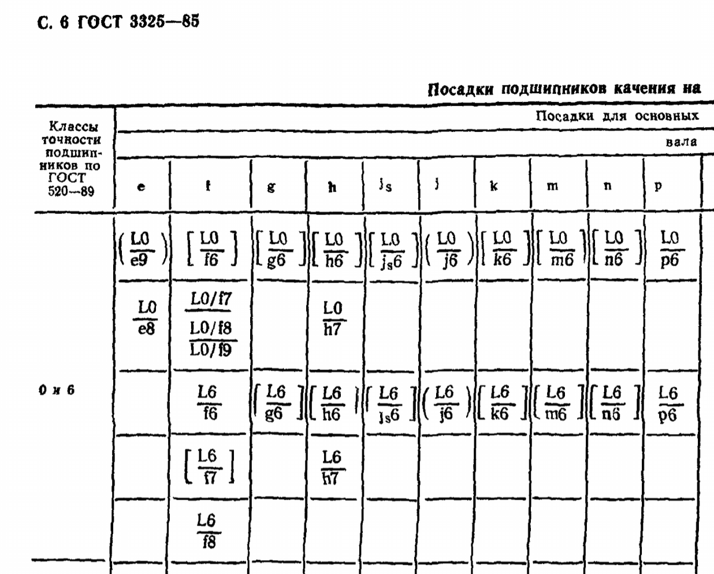
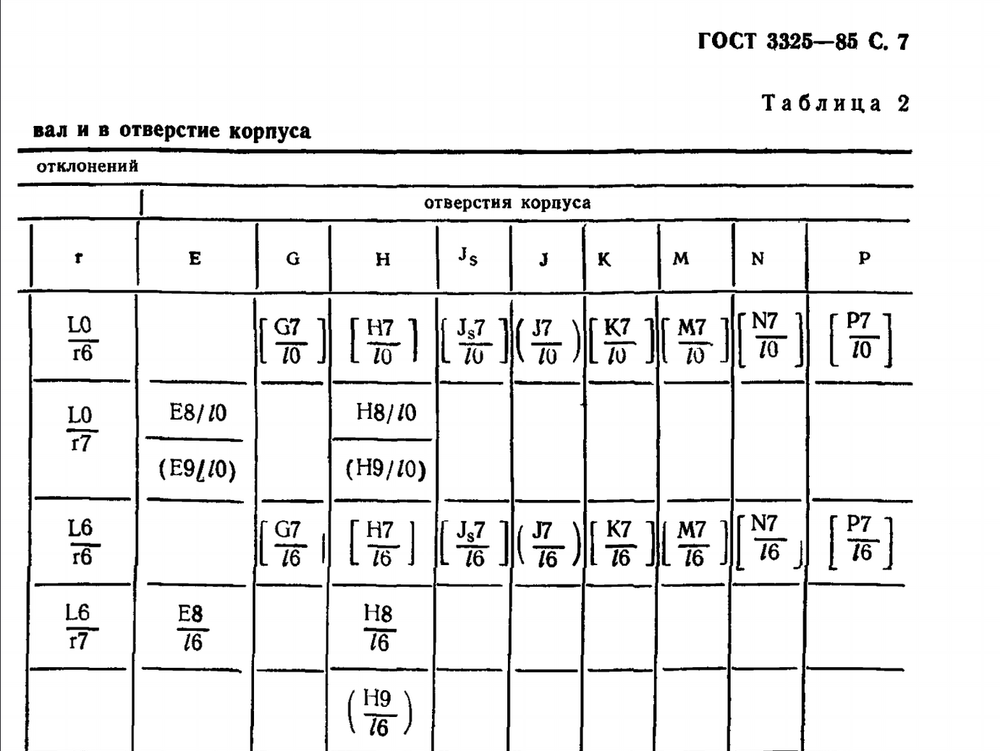
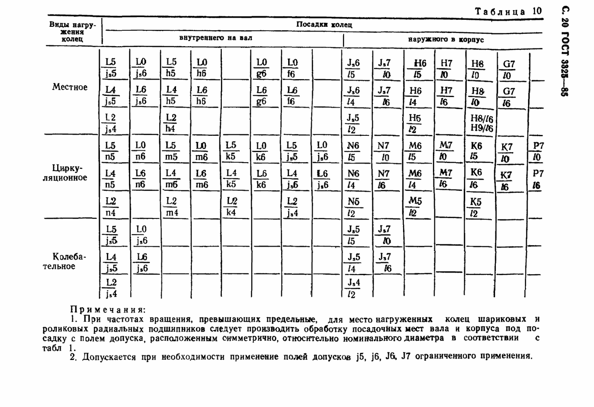
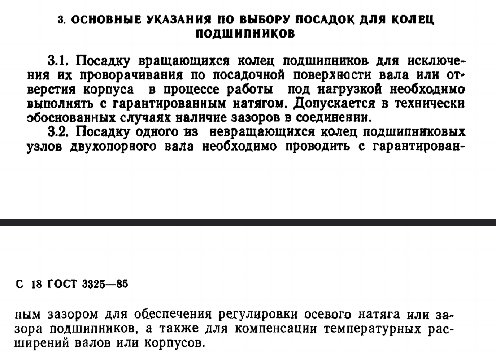
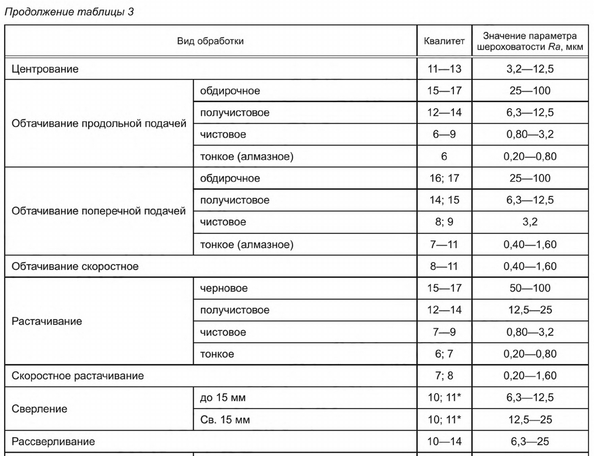
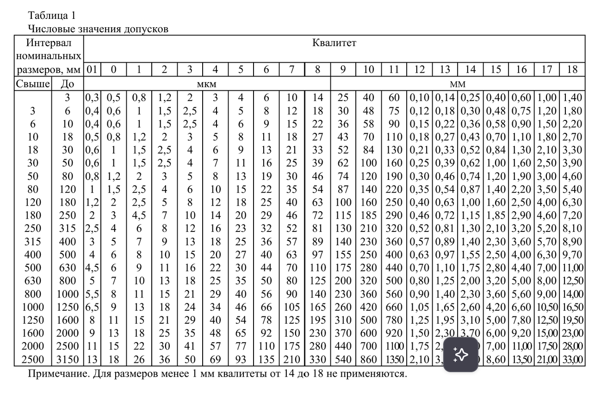

# DM
# Рабочий конспект: Детали машин 


## Раздел 1. Выбор посадок (сборочный чертёж)

### 1.1. Подшипники качения (ГОСТ 3325-85)

| Сопряжение | Поле допуска | Характер | Когда применять | Источник |
|------------|--------------|----------|----------------|----------|
| Вал ↔ внутреннее кольцо (вращается) | k6, m6, n6 | Натяг | Кольцо вращается относительно нагрузки, требуется фиксация от проворота | ГОСТ 3325-85, табл. 4; Анурьев т.1, табл. 22 |
| Корпус ↔ наружное кольцо (неподвижно) | H7, J7 | Зазор/переходная | Кольцо неподвижно, нужна компенсация теплового расширения, упрощение монтажа | ГОСТ 3325-85, табл. 4; Анухин, гл. 8 |
| Вал ↔ внутреннее кольцо (лёгкая нагрузка, съём) | js6, h6 | Переходная/зазор | Периодический демонтаж, реверсивное вращение с малым моментом | Анурьев т.1, табл. 22 |


| Параметр | Ситуация 1 (Внутреннее кольцо вращается) | Ситуация 2 (Наружное кольцо неподвижно) | Ситуация 3 (Лёгкая нагрузка / Съём) |
| :--- | :--- | :--- | :--- |
| **Сопряжение** | **Вал ↔ Внутреннее кольцо** | **Корпус ↔ Наружное кольцо** | **Вал ↔ Внутреннее кольцо** |
| **Посадка (пара)** | **H7/k6**, **H7/m6**, **H7/n6** | **H7/h6**, **J7/h6**, **H7/js6** | **H7/g6**, **H7/h6**, **H7/js6** |
| **Характер** | **Натяг** | **Зазор** или **Переходная** | **Зазор** или **Переходная** |
| **Главная цель** | Исключить проворот кольца на валу | Компенсировать тепловое удлинение, упростить монтаж | Упростить демонтаж, юстировку |
| **Последствия ошибки** | Проворот → задиры → заклинивание | Перегрев → осевое распирание → разрушение | При росте нагрузки — проворот кольца |
| **Источник** | ГОСТ 3325-85, табл. 4; Анурьев т.1, табл. 22 | ГОСТ 3325-85, табл. 4; Анурьев т.1, табл. 22 | ГОСТ 3325-85, табл. 4; Анурьев т.1, табл. 22 |
Посадка подшипников ГОСТ 3325-85  



Посадка подшипников в зависимости от вида нагружения:

Тоже, что и выше, но в анухине - стр. 48

Рекомендации по посадке колец подшипников:



**Комментарий:** Для подшипников нормальной точности (класс 0) отверстие кольца имеет поле допуска, эквивалентное H7 (но со смещением). Поэтому на вал выбираем k6/m6 для получения натяга. Разница квалитетов между валом и отверстием подшипника не должна превышать 1.

---

### 1.2. Шестерни, шкивы, муфты на валу

| Сопряжение | Поле допуска | Характер | Когда применять | Источник |
|------------|--------------|----------|----------------|----------|
| Вал ↔ ступица (передача момента, центрирование) | H7/k6, H7/js6 | Переходная | Умеренная нагрузка, требуется точное центрирование, возможен периодический съём | ГОСТ 25346-89; Анурьев т.1, табл. 15 |
| Вал ↔ ступица (ударная нагрузка, постоянная сборка) | H7/r6, H7/s6 | Натяг | Передача больших крутящих моментов, ударные нагрузки, отсутствие шпонки | Анурьев т.1, табл. 15 |
| Вал ↔ ступица (лёгкий ход, юстировка) | H7/g6, H7/f7 | Зазор | Требуется осевое перемещение, регулировка положения, лёгкое вращение от руки | ГОСТ 25347-82; Анурьев т.1, табл. 18 |

**Комментарий:** Для шестерён с шпоночным соединением достаточно переходной посадки — момент передаёт шпонка, а посадка обеспечивает только центрирование. Если шпонки нет — нужен натяг.

---

### 1.3. Втулки скольжения и направляющие

| Сопряжение | Поле допуска | Характер | Когда применять | Источник |
|------------|--------------|----------|----------------|----------|
| Вал ↔ втулка (вращение, смазка) | H7/g6, H7/f7 | Зазор | Образование масляного клина, компенсация теплового расширения, средняя скорость | ГОСТ 25347-82; Анурьев т.1, табл. 18 |
| Вал ↔ втулка (поступательное движение) | H8/e8, H8/d9 | Зазор | Направляющие, ползуны, большие зазоры для компенсации перекосов | Анурьев т.1, табл. 19 |
| Вал ↔ втулка (точное центрирование, малый ход) | H7/h6 | Минимальный зазор | Точные механизмы, малые скорости, отсутствие смазки | ГОСТ 25346-89 |
Анухин. 
Зазор - 18-19
Переходные - 23-24
Натяг - 25
---

### 1.4. Уплотнения и манжеты

| Сопряжение | Поле допуска | Характер | Когда применять | Источник |
|------------|--------------|----------|----------------|----------|
| Вал ↔ манжета резиновая (рабочая кромка) | H7/h9 или H8/f7 | Зазор | Исключение заедания кромки, компенсация радиального биения вала, Свободная установка уплотнения, компенсация радиального биения вала, предотвращение перегрева и износа резиновой кромки | Анурьев т.2, гл. по уплотнениям; ГОСТ 25347-82 |
| Корпус ↔ манжета (наружная посадка) |H7/h6 или H8/js7 | Натяг/переходная | Фиксация манжеты в корпусе, герметичность стыка, Жёсткая фиксация манжеты в корпусе, герметичность стыка, исключение провертывания под давлением | Анурьев т.2 |
| Вал ↔ кольцо пылезащитное | H11/a11 или H12/d11 |  Большой зазор | Неответственные узлы, защита от пыли без требований к герметичности, 	
Неответственные узлы, защита от пыли/брызг без требований к герметичности, упрощение сборки | Справочник конструктора |

**Комментарий:** Поверхность вала под манжету должна иметь шероховатость Ra 0.4–0.8 мкм (см. раздел 3). Зазор в посадке предотвращает перегрев и износ резины при сборке.

---

### 1.5. Шпоночные и шлицевые соединения

| Сопряжение | Поле допуска | Характер | Когда применять | Источник |
|------------|--------------|----------|----------------|----------|
| Паз вала ↔ шпонка (по ширине) | JS9/h9, P9/h9 | Переходная/натяг | JS9 — нормальные нагрузки, съёмные детали; P9 — ударные, реверсивные нагрузки | ГОСТ 23360-78; Анухин, табл. выбора посадок шпонок |
| Паз ступицы ↔ шпонка | D10/h9, Js9/h9 | Зазор/переходная | Обеспечение лёгкой сборки, компенсация погрешностей изготовления | ГОСТ 23360-78 |
| Шлицевое соединение (центрирование по боковым поверхностям) | H7/f7, H7/g6 | Зазор | Точное центрирование, передача момента, возможность осевого перемещения | ГОСТ 1139-80; Анурьев т.1 |

**Комментарий:** Допуск ширины паза — критичный параметр. Неправильный выбор ведёт к перекосу шпонки и смятию граней. Для призматических шпонок всегда указывать допуск на ширину, глубину — по общему квалитету.

---

### 1.6. Корпусные соединения (крышки, фланцы, стыки)

| Сопряжение | Поле допуска | Характер | Когда применять | Источник |
|------------|--------------|----------|----------------|----------|
| Корпус ↔ крышка (центрирование) | H7/h6, H7/js6 | Зазор/переходная | Совмещение отверстий под крепёж, герметичность стыка через прокладку | ГОСТ 25346-89; Анурьев т.1 |
| Корпус ↔ втулка (неподвижная посадка) | H7/r6, H7/s6 | Натяг | Жёсткая фиксация втулки в корпусе, передача радиальных нагрузок | Анурьев т.1 |


---


## Раздел 2. Допуски размеров на детали (чертёж детали)

### 2.1. Какие размеры требуют допусков (функционально важные)

| Тип размера | Рекомендуемый квалитет | Источник |
|-------------|------------------------|----------|
| Посадочные диаметры (под подшипники, шестерни) | IT6–IT7 | ГОСТ 25346-89; Анурьев т.1 |
| Длины посадочных участков, расстояния между опорами | IT7–IT8 | Анухин, гл. 3 |
| Ширина шпоночного паза, глубина | IT9–IT10 (по ГОСТ 23360) | ГОСТ 23360-78 |
| Диаметры под уплотнения, пыльники | IT9–IT10 | Анурьев т.2 |
| Резьбы, фаски, проточки (непосадочные) | IT11–IT12 | ГОСТ 30893.1-2002 |
| Габаритные, справочные размеры |  Без допуска или ±IT14 | ГОСТ 2.307-68 |


---

### 2.2. Избегайте избыточной точности

| Квалитет | Типичное применение | Почему не ставить без причины |
|----------|---------------------|-------------------------------|
| IT01–IT4 | Калибры, прецизионные приборы, оптика | Чрезвычайно высокая стоимость обработки, требует специального оборудования |
| IT5 | Подшипники высокой точности, зубчатые колёса 6–7 степени точности | Шлифование, притирка, контроль в температурной лаборатории |
| IT6–IT7 | Посадочные поверхности общего машиностроения | Оптимальное соотношение точности и стоимости (точение, шлифование) |
| IT8–IT9 | Ответственные, но не посадочные размеры | Точное точение, развёртывание |
| IT10–IT12 | Свободные размеры, литьё, штамповка | Экономически целесообразно, не влияет на работу узла |

**Источник:** Анурьев В.И., т.1, гл. 1 «Экономическая точность обработки»; Анухин В.Н., гл. 2 «Выбор квалитетов».


---

### 2.3. Технические требования: обязательные строки

В блок технических требований (добавлять ЧЕРЕЗ МЕНЮ ОФОРМЛЕНИЯ САПР):

```
1. Неуказанные допуски размеров по ГОСТ 30893.1-2002, класс точности:
   - для отверстий: H12
   - для валов: h12
   - для остальных: ±IT12/2 (или js12)

2. Неуказанные допуски формы и расположения поверхностей по ГОСТ 2.308-79,
   квалитет 8–9.

3. Неуказанная шероховатость поверхностей: Ra 6.3 по ГОСТ 2.309-73.

4. Острые кромки притупить, радиус скругления 0.5...1.0 мм.
```

**Источник:** ГОСТ 30893.1-2002; ГОСТ 2.308-79; ГОСТ 2.309-73.


---

## Раздел 3. Шероховатость поверхностей

### 3.1. Рекомендации по выбору Ra
Шероховатость от типа обработки ГОСТ Р 70117—2022
  


| Тип поверхности | Рекомендуемое Ra, мкм | Метод получения | Источник |
|-----------------|------------------------|-----------------|----------| 
| Посадочные шейки под подшипники качения | 0.4–0.8 | Шлифование, хонингование | Анурьев т.2, табл. 4; ГОСТ 2789-73 |
| Поверхности под уплотнительные манжеты | 0.4–0.8 | Шлифование, полирование | Анурьев т.2, гл. по уплотнениям |
| Посадочные поверхности под шестерни, втулки | 1.6–3.2 | Точение чистовое, шлифование | Анурьев т.2, табл. 4 |
| Шпоночные пазы, шлицы | 3.2–6.3 | Фрезерование, протягивание | ГОСТ 2.309-73 |
| Торцевые упорные поверхности, фланцы | 3.2–6.3 | Точение, фрезерование | Анурьев т.2 |
| Нерабочие поверхности, литьё без обработки | 12.5 или «не обрабатывать» | Литьё, штамповка | ГОСТ 2789-73 |
| Свободные поверхности после черновой обработки | 25 | Черновое точение, пиление | — |

---

| Квалитет | Экономический диапазон Ra, мкм | Типовые методы обработки | Функциональное применение | Риск конфликта с допуском | Источник |
|:---:|:---:|:---|:---|:---:|:---|
| **IT5–IT6** | 0.1 – 0.4 | Шлифование, хонингование, притирка | Прецизионные сопряжения, подшипники качения высокой точности, гидроцилиндры, плунжерные пары | Низкий (параметры согласованы технологически) | Анурьев В.И., т.2, табл. 4; ГОСТ 2789-73 |
| **IT7** | 0.4 – 1.6 | Чистовое шлифование, тонкое точение, развёртывание | Посадочные шейки валов под подшипники/шестерни, ответственные отверстия, шлицевые соединения | Низкий | Анухин В.Н., гл. 3; Анурьев т.2 |
| **IT8** | 1.6 – 3.2 | Чистовое точение/расточка, протягивание, чистовое фрезерование | Ступицы, фланцы, направляющие, соединения с переходными посадками средней точности | Низкий | Анурьев т.2; ГОСТ 25346-89 |
| **IT9** | 3.2 – 6.3 | Получистовое точение, сверление, зенкерование, фрезерование | Шпоночные пазы, крепёжные отверстия, неподвижные втулки, корпусные элементы | Низкий | Анухин В.Н., гл. 4; Анурьев т.2 |
| **IT10–IT11** | 6.3 – 12.5 | Черновое/получистовое точение, расточка, литьё по моделям | Свободные диаметры, литые/штампованные поверхности с минимальной доводкой, заглушки | **Средний** (нельзя ставить Ra < 3.2) | ГОСТ 30893.1-2002; Анурьев т.2 |
| **IT12–IT14** | 12.5 – 25+ | Литьё, ковка, штамповка, резка, черновая обработка | Габаритные размеры, заготовки, неразъёмные соединения, декоративные элементы | **Высокий** (нельзя ставить Ra < 6.3) | ГОСТ 2789-73; Анурьев т.2 |

Анурьев стр. 359
---

## Раздел 4. Геометрические допуски (формы и расположения)

### 4.1. Базовое правило: когда нужна база

| Тип допуска | Нужна ли база? | Почему |
|-------------|----------------|--------|
| Форма: цилиндричность, плоскостность, прямолинейность, круглость | НЕТ | Характеризует отклонение самой поверхности от идеальной формы |
| Расположение: соосность, перпендикулярность, параллельность, симметричность | ДА | Характеризует отклонение относительно другой поверхности (базы) |
| Биение: радиальное, торцевое | ДА | Измеряется относительно оси вращения (базы) |

**Источник:** ГОСТ 2.308-79; Анухин В.Н., гл. 5–6.

**Комментарий:** Проставление базы у допуска формы (например, цилиндричности) или отсутствие базы у допуска расположения (например, перпендикулярности) — грубая ошибка.
 
---

### 4.2. Типовые геометрические допуски для валов и шестерён

| Поверхность | Тип допуска | Рекомендуемое значение | База | Источник |
|-------------|-------------|------------------------|------|----------|
| Посадочная шейка вала под подшипник | Цилиндричность | 0.008–0.015 мм | — | ГОСТ 2.308-79; Анурьев т.1 |
| Посадочная шейка под шестерню | Радиальное биение | 0.02–0.04 мм | Ось вращения (А-В) | Анурьев т.1 |
| Торцевой упор под подшипник | Перпендикулярность к оси | 0.02–0.03 мм на 100 мм | Ось шейки | ГОСТ 2.308-79 |
| Шпоночный паз | Симметричность относительно оси | 0.02 мм | Ось вала | ГОСТ 23360-78 |
| Ступица шестерни (наружная поверхность) | Соосность с посадочным отверстием | ⌀0.03–0.05 мм | Ось отверстия | Анурьев т.1 |
| Плоскость стыка корпуса | Плоскостность | 0.05–0.1 мм | — | ГОСТ 2.308-79 |

**Комментарий:** Значение геометрического допуска обычно составляет 30–50% от допуска размера. Например, при допуске диаметра 0.025 мм (IT7) цилиндричность берут 0.008–0.012 мм.

Допуски для валов подшипников есть в ГОСТ 3325-85 Таблица 4-6
---

##  Сводная таблица применения

| Допуск | База | Типичное значение | Когда обязателен | Когда лишний |
|:---|:---:|:---|:---|:---|
| **Прямолинейность** | НЕТ | 0.01–0.05 | Направляющие, длинные валы | Короткие детали, есть цилиндричность |
| **Плоскостность** | НЕТ | 0.02–0.1 | Привалочные поверхности | Нерабочие поверхности |
| **Круглость** | НЕТ | 0.003–0.01 | Посадочные шейки, отверстия | Есть цилиндричность |
| **Цилиндричность** | НЕТ | 0.005–0.015 | Посадки под подшипники | Короткие поверхности (L/D<1) |
| **Параллельность** | ДА | 0.02–0.05 | Направляющие, оси валов | Одиночные валы |
| **Перпендикулярность** | ДА | 0.01–0.04 | Торцы под подшипники | Нерабочие торцы |
| **Соосность** | ДА | 0.02–0.05 | Ступенчатые валы | Одна шейка |
| **Симметричность** | ДА | 0.01–0.03 | Шпоночные пазы | Несимметричные детали |
| **Радиальное биение** | ДА | 0.02–0.05 | Вращающиеся поверхности | Неподвижные детали |

---

Выбор численных значений 30-50% от численного значения квалитета для данного рамера ГОСТ 25346-89:


**Источник:** Анухин В.Н., гл. 6 «Выбор баз»; ГОСТ 2.308-79.

---

## Раздел 5. Шаблоны обоснований (копировать и адаптировать)

### 5.1. Для посадки

```
Элемент: [наименование сопряжения, размер, например: Вал Ø40 ↔ внутреннее кольцо подшипника]
Выбрано: [посадка, например: Ø40k6]
Обоснование: [функция в узле + характер нагрузки/движения + проверка квалитетов].
Пример: Для вращающегося внутреннего кольца подшипника требуется посадка с гарантированным натягом, исключающим проскальзывание и фреттинг-коррозию. Разница квалитетов между валом (IT6) и отверстием кольца (эквивалент IT5) составляет 1, что соответствует требованиям ГОСТ 3325-85. Конфликтующих посадок на данном участке вала нет.
Источник: ГОСТ 3325-85, табл. 4; Анурьев В.И. «Справочник конструктора-машиностроителя», т.1, табл. 22.
```

### 5.2. Для допуска размера

```
Элемент: [наименование поверхности, размер, например: Посадочная шейка вала под шестерню, Ø35]
Выбрано: [допуск, например: Ø35js7]
Обоснование: [функция поверхности + связь с посадкой/сборкой + экономическая целесообразность].
Пример: Размер является посадочным для переходной посадки H7/js7, обеспечивающей точное центрирование ступицы и передачу крутящего момента через шпонку. Квалитет IT7 выбран как оптимальный по соотношению точности и стоимости обработки (чистовое точение). Более точный квалитет (IT5–IT6) не требуется, так как сопряжение не является прецизионным.
Источник: ГОСТ 25346-89; Анурьев В.И., т.1, гл. 1; Анухин В.Н. «Допуски и посадки», гл. 3.
```

### 5.3. Для шероховатости

```
Элемент: [поверхность, например: Шейка вала под уплотнительную манжету, Ø30]
Выбрано: [параметр, например: Ra 0.63]
Обоснование: [функция поверхности + требования к износу/герметичности + технологическая достижимость].
Пример: Поверхность контактирует с резиновой кромкой манжеты, поэтому требуется низкая шероховатость для предотвращения износа и обеспечения герметичности. Значение Ra 0.63 мкм достигается шлифованием и соответствует рекомендациям для уплотнительных узлов. Более грубая шероховатость (Ra > 1.6) недопустима из-за риска утечек.
Источник: ГОСТ 2789-73; Анурьев В.И., т.2, гл. по уплотнениям.
```

### 5.4. Для геометрического допуска

```
Элемент: [поверхность + тип допуска, например: Посадочная шейка вала, цилиндричность]
Выбрано: [значение, например: 0.01 мм]
Обоснование: [функция допуска + связь с посадкой/работой узла + правило баз].
Пример: Цилиндричность посадочной шейки обеспечивает равномерный контакт с кольцом подшипника, предотвращая локальные перегрузки и преждевременный износ. Значение 0.01 мм составляет ~40% от допуска размера (IT7 = 0.025 мм), что соответствует рекомендациям. База не указывается, так как цилиндричность — допуск формы.
Источник: ГОСТ 2.308-79; Анухин В.Н. «Допуски и посадки», гл. 5.
```

---

## Раздел 6. Финальный чек-лист перед сдачей

### Сборочный чертёж (30 баллов)
- [ ] Проставлено ровно 5 посадок
- [ ] Для каждой посадки: разница квалитетов ≤ 2
- [ ] Нет конфликтующих посадок на одном цилиндрическом участке
- [ ] Тип посадки соответствует функции (зазор/натяг/переходная)
- [ ] На каждую посадку написано обоснование по шаблону: функция + проверка квалитетов + источник
- [ ] Источники указаны конкретно: ГОСТ №, Анурьев т.1, табл. ХХ, Анухин, стр. ХХ

### Чертёж детали: допуски размеров (15+15 баллов)
- [ ] Допуски проставлены только на функционально важные размеры
- [ ] Отсутствуют необоснованные IT01–IT5
- [ ] В технических требованиях есть строка: «Неуказанные допуски размеров по ГОСТ 30893.1-2002...»
- [ ] На каждый допуск написано обоснование: функция + связь с посадкой + источник
- [ ] Обоснования оформлены текстом, со ссылками на источники

### Чертёж детали: шероховатость (15+15 баллов)
- [ ] Указана шероховатость на все рабочие поверхности
- [ ] Значения Ra соответствуют функции и методу обработки
- [ ] Нет конфликта: грубая шероховатость на трущейся поверхности / сверхгладкая при грубом допуске
- [ ] В правом верхнем углу стоит общий знак шероховатости (добавлен через меню САПР)
- [ ] В технических требованиях есть строка: «Неуказанная шероховатость поверхностей: Ra 6.3 по ГОСТ 2.309-73»
- [ ] На каждую шероховатость написано обоснование: функция + технология + источник

### Чертёж детали: геометрические допуски (15+15 баллов)
- [ ] Геометрические допуски проставлены только на функциональные поверхности
- [ ] Допуски формы (цилиндричность, плоскостность) — без базы
- [ ] Допуски расположения/биения (соосность, перпендикулярность, биение) — с базой
- [ ] Базы выбраны на функциональных поверхностях, не более 1–2 основных
- [ ] В технических требованиях есть строка: «Неуказанные допуски формы и расположения... по ГОСТ 2.308-79»
- [ ] На каждый геометрический допуск написано обоснование: функция + правило баз + источник

### Оформление и общие требования
- [ ] Все выноски, допуски, шероховатости читаемы, не пересекают виды и друг друга
- [ ] Знаки шероховатости и геометрических допусков явно привязаны к поверхностям
- [ ] Технические требования и общая шероховатость добавлены через штатное меню оформления САПР (не нарисованы вручную)
- [ ] Все обоснования написаны собственным текстом, с конкретными ссылками на источники
- [ ] Отсутствуют скриншоты из интернета/ИИ без пояснений

